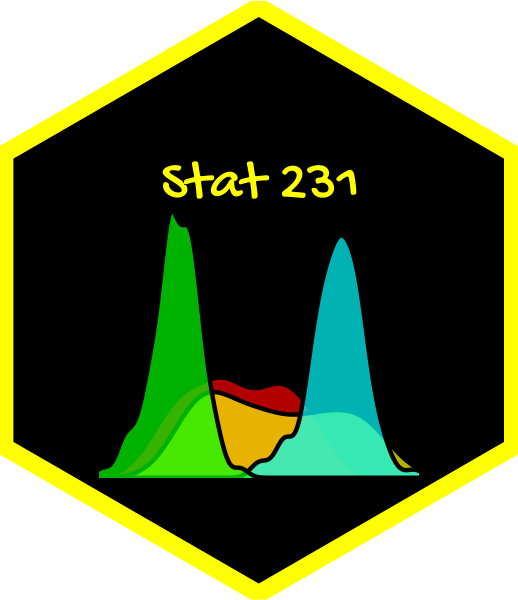

--- 
title: "Stat 231: Introductory Statistics"
author: "N. Paterno"
date: "`r Sys.Date()`"
site: bookdown::bookdown_site
output: 
  bookdown::gitbook:
          number_sections: FALSE
documentclass: book
bibliography: [book.bib, packages.bib]
biblio-style: apalike
link-citations: yes
github-repo: npaterno/bookdown-demo
description: "This is a test for a course shell based on a minimal example of using the bookdown package to write a book. The output format is bookdown::gitbook."
---

# {-}
<center>
  **Work In Progress**
</center>

This is the hub for Stat 231 at PLU with N. Paterno. Here you will find (a link to) the textbook, readings, homework, R labs \& screencasts, video lessons and links to slides.


```{r include=FALSE}
# automatically create a bib database for R packages
knitr::write_bib(c(
  .packages(), 'bookdown', 'knitr', 'rmarkdown', 'openintro', 'ggthemes', 'ggdark', 'modelr', 'infer', 'lubridate', 'moderndive' 
), 'packages.bib')
```
